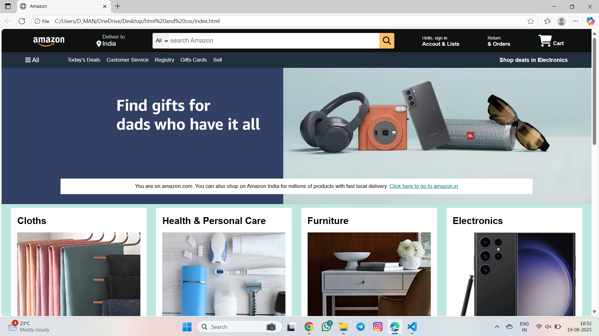
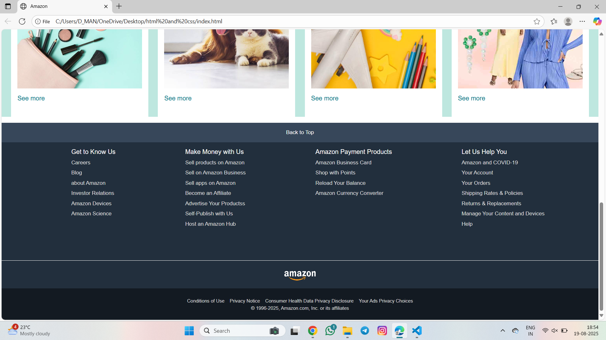

# Amazon Clone 🛒

A simple frontend clone of **Amazon’s homepage** built using **HTML & CSS**.  
This project was created as part of my web development learning.

---

## 🖼️ Preview

### 📌 Top Section

### 📌 Footer Section

---

## 🚀 Features

- Responsive navigation bar with logo, location, search, sign-in, and cart
- Hero section with promotional banner
- Grid-style product categories (Clothing, Electronics, Toys, etc.)
- Functional and styled footer with multiple sections
- Clean, reusable CSS classes and structure

---

## 📁 Tech Used

- **HTML5**
- **CSS3**
- Font Awesome (via CDN)
- No JavaScript used

---

## 📂 File Structure

amazon-clone/
│
├── amazon_clone_1.png
├── amazon_clone_2.png
├── amazon_logo.png
├── hero_image.jpg
├── box1_image.jpg
├── box2_image.jpg
├── box3_image.jpg
├── box4_image.jpg
├── box5_image.jpg
├── box6_image.jpg
├── box7_image.jpg
├── box8_image.jpg
└── index.html
└── Style.css

---

## 🧠 What I Learned

- Structuring HTML for real-world layouts
- Styling complex web pages using CSS
- Understanding box model, flexbox, and hover effects
- How real e-commerce websites organiz
